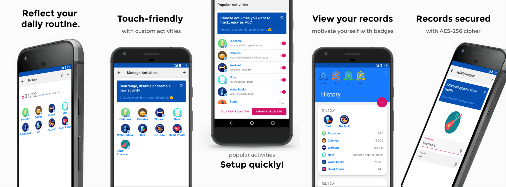

# Dr. Diary

<h1 align=center>

</h1>

Android app for tracking daily routine

### Features
:heavy_check_mark: Create custom activities, reorder them (drag'n'drop in Activity Manager, remove unused (longpress in Activity Manager)

:heavy_check_mark: Edit previous records

:heavy_check_mark: Create records for any date (click on date in My Day to open date picker)

:heavy_check_mark: View activity's history and statistics - longpress on activity in the History overview
 
:heavy_check_mark: Backup & Restore (via Firebase)

:white_check_mark: App shortcut for launcher

:white_check_mark: Dark mode

:white_check_mark: Widget

:white_check_mark: Google Fit integration
